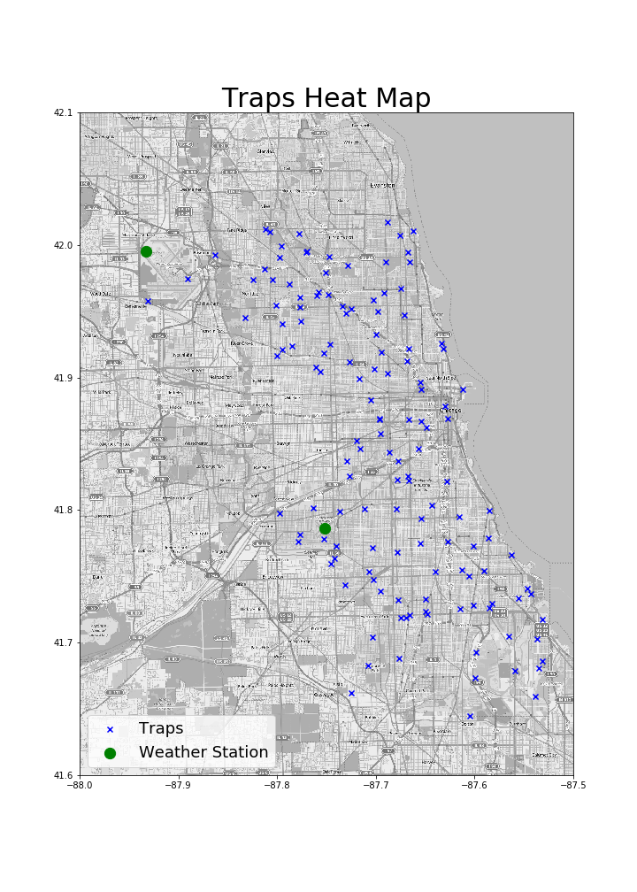
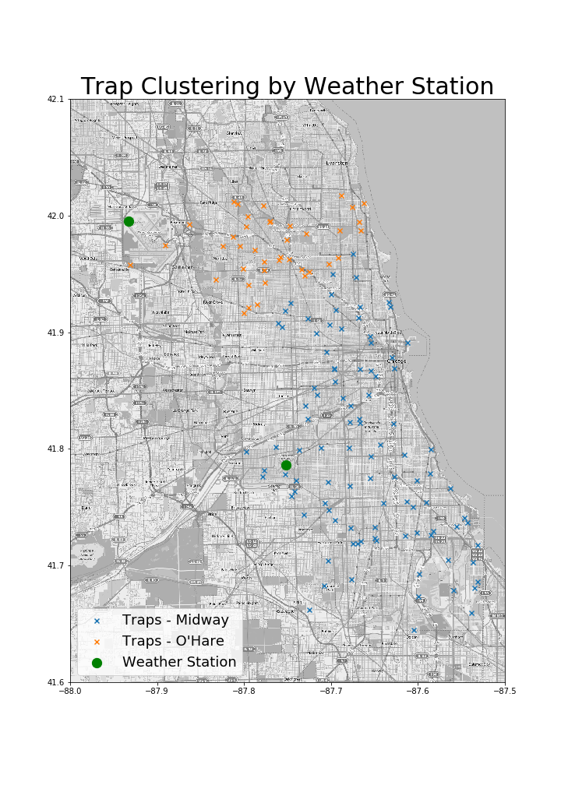
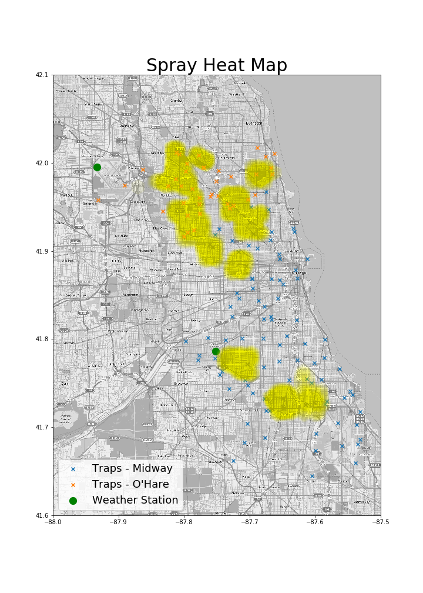
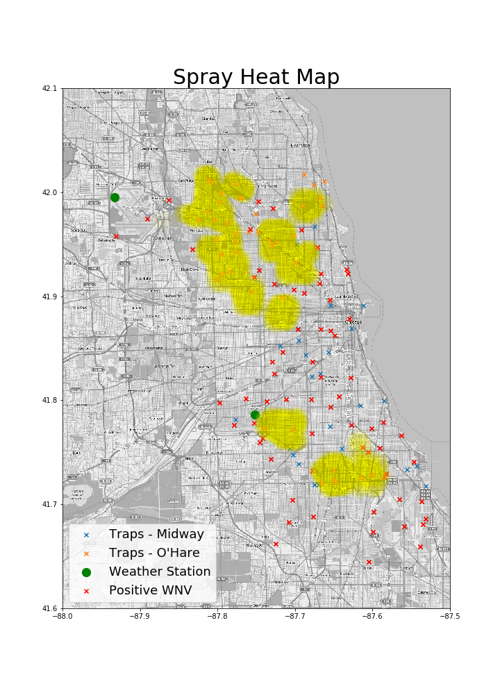
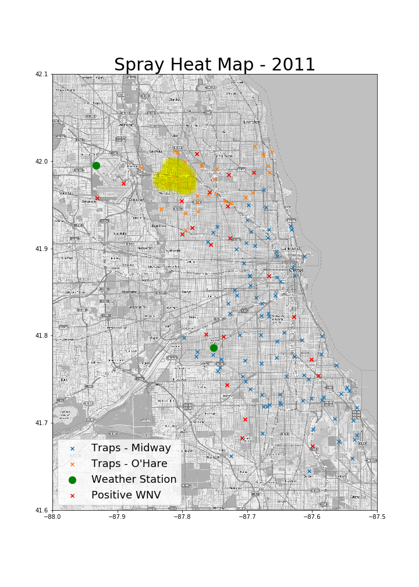
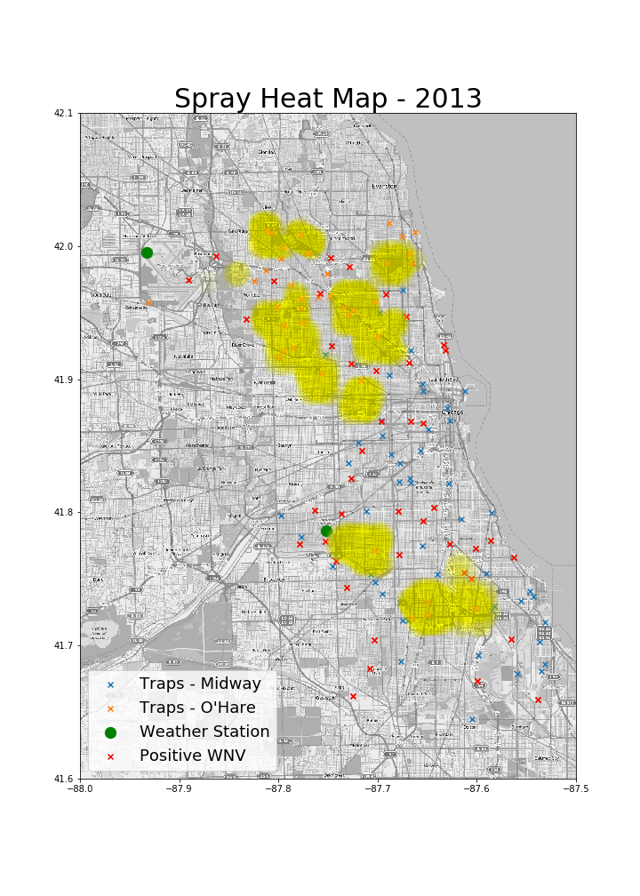
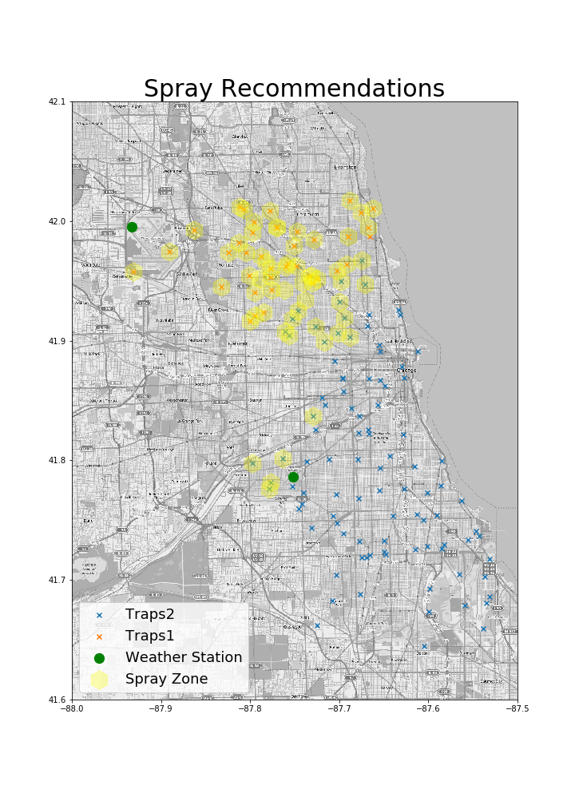

# West-Nile-Virus-Prediction

#### Kaggle Competition
West Nile virus is most commonly spread to humans through infected mosquitos. Around 20% of people who become infected with the virus develop symptoms ranging from a persistent fever, to serious neurological illnesses that can result in death.

In 2002, the first human cases of West Nile virus were reported in Chicago. By 2004 the City of Chicago and the Chicago Department of Public Health (CDPH) had established a comprehensive surveillance and control program that is still in effect today.

Every week from late spring through the fall, mosquitos in traps across the city are tested for the virus. The results of these tests influence when and where the city will spray airborne pesticides to control adult mosquito populations.

Given weather, location, testing, and spraying data, this competition asks you to predict when and where different species of mosquitos will test positive for West Nile virus. A more accurate method of predicting outbreaks of West Nile virus in mosquitos will help the City of Chicago and CPHD more efficiently and effectively allocate resources towards preventing transmission of this potentially deadly virus.

#### The Data
There were two sets given: training and test. The training set consisted of data from 2007, 2009, 2011, and 2013, while the test set consisted of data from 2008, 2010, 2012, and 2014.

Both training and test sets consists of test data from each trap location. Along with this set, we were also given spray and weather data to try and improve our predictions.

  

<caption align="bottom">Figure 1. Trap Locations </caption>

First I wanted to see a visual of the testing and weather locations. Then sought to group each trap to the nearest weather station data. Using the haversine formula to determine distance, I was able group trap locations accordingly.

  

<caption align="bottom">Figure 2. Trap Sorted Locations </caption>

Then adding in the provided spray data provided more depth to the data.

  

<caption align="bottom">Figure 3. Trap Sorted Locations </caption>

The overlay currently consists of all the data provided therefore, the positive hits might not be fully indicative of the results of spraying.

  

<caption align="bottom">Figure 4. Spray Locations </caption>

The city of Chicago only sprayed for WNV two years 2011 and 2013.

  

<caption align="bottom">Figure 5. 2011 Spray Locations </caption>

  

<caption align="bottom">Figure 6. 2013 Spray Locations </caption>

According to the data, it seems that spraying does help prevent WNV but only limited to a small radius.

#### The Model
This challenge was not based on accuracy as the chances for positive WNV was very low. Therefore, the best metric to measure predictions is AUC - Area Under the Curve. This will better measure the probability at each test trap location.

As the final indicator is positive or not, this is a classic classification problem. After a couple attempts, the best results were seen using a random forrest classifier with a 0.69901 score. The top score of the competition was 0.85990 so my score has some room to improve.

#### Recommendation
If I were to provide a recommendation to the city of Chicago, I would suggest the following areas for maximum benefit. As excessive spraying could be both expensive and potentially harmful for the residents, the city cannot simply spray all locations.

  

<caption align="bottom">Figure 7. Spray Recommendations</caption>

